# MyApp Store

<div align="center">

**NAS 기반 개인 소프트웨어 라이브러리 관리 시스템**

[](https://github.com/zardkim/my-appstore/releases)
[](LICENSE)
[](https://hub.docker.com/u/zardkim)

[🇺🇸 English](README.md) | [🇰🇷 한국어](README.ko.md)

</div>

---

## 📸 스크린샷

<table>
  <tr>
    <td>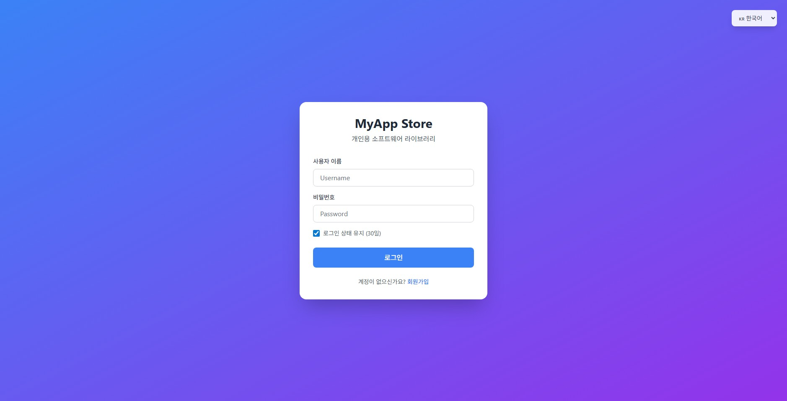<br/><sub>로그인</sub></td>
    <td>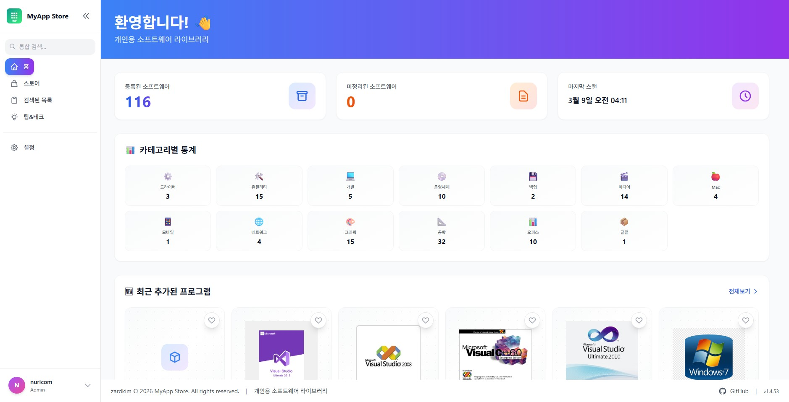<br/><sub>홈 대시보드</sub></td>
    <td>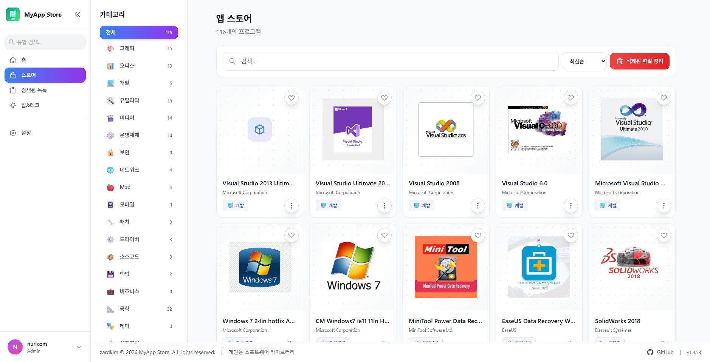<br/><sub>앱 스토어</sub></td>
  </tr>
  <tr>
    <td>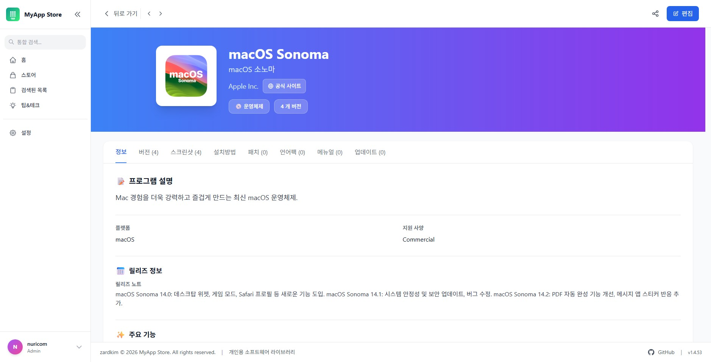<br/><sub>제품 상세</sub></td>
    <td>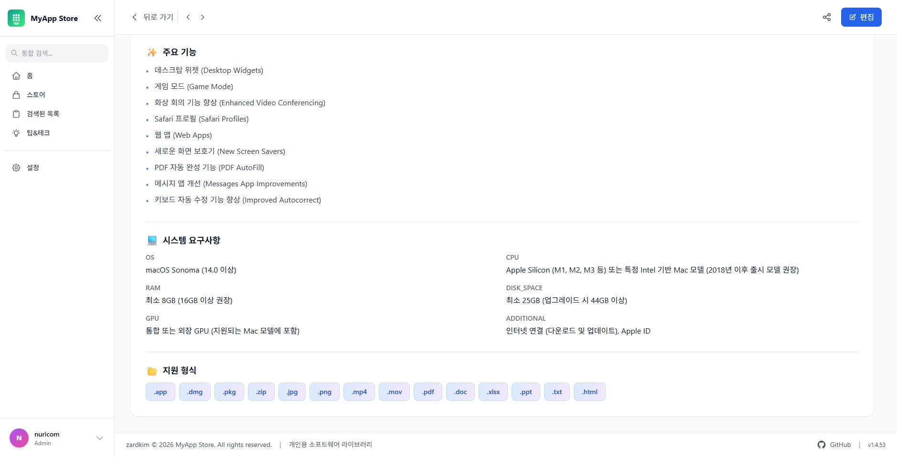<br/><sub>제품 상세 (기능/사양)</sub></td>
    <td>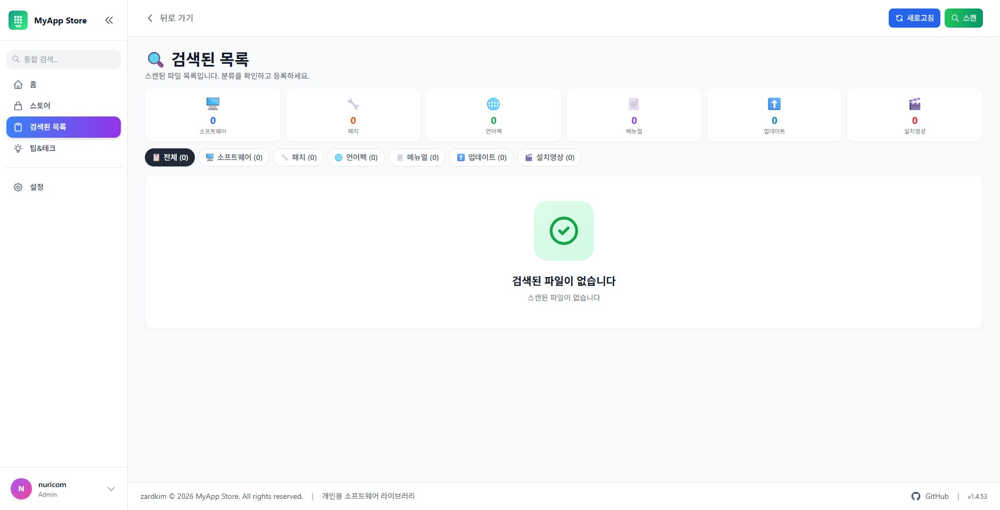<br/><sub>검색된 목록</sub></td>
  </tr>
  <tr>
    <td>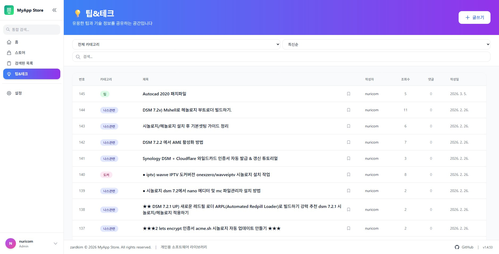<br/><sub>팁&amp;테크 게시판</sub></td>
    <td>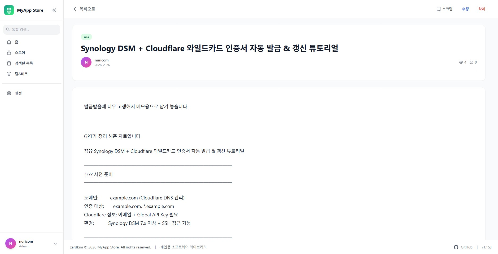<br/><sub>팁&amp;테크 게시글</sub></td>
    <td>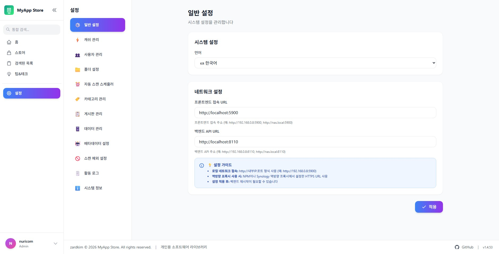<br/><sub>설정 - 일반</sub></td>
  </tr>
  <tr>
    <td>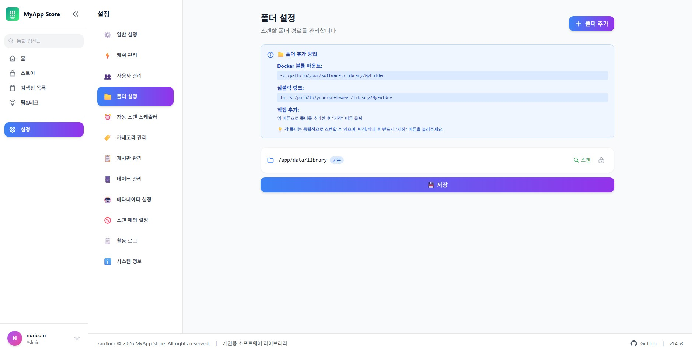<br/><sub>설정 - 폴더</sub></td>
    <td>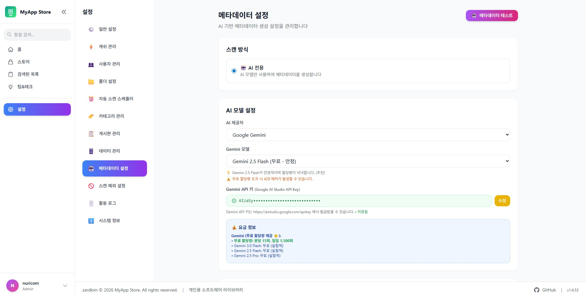<br/><sub>설정 - 메타데이터 (AI)</sub></td>
    <td></td>
  </tr>
</table>

---

## 🐳 Docker 설치

### 1. 파일 다운로드

```bash
mkdir myappstore && cd myappstore

wget https://raw.githubusercontent.com/zardkim/my-appstore/main/docker-compose.yml
wget https://raw.githubusercontent.com/zardkim/my-appstore/main/.env.example
```

### 2. 환경 변수 설정

```bash
cp .env.example .env
nano .env
```

### 3. 필수 폴더 생성

```bash
mkdir -p db redis data/library
```

### 4. 실행

```bash
docker-compose up -d

# 상태 확인
docker-compose ps

# 로그 확인
docker-compose logs -f
```

### 5. 접속

| 서비스 | URL |
|--------|-----|
| 프론트엔드 | http://localhost:5900 |
| 백엔드 API | http://localhost:8110 |
| API 문서 | http://localhost:8110/docs |

> 첫 접속 시 관리자 계정 생성 마법사가 실행됩니다.

---

## ⚙️ 환경 변수 (.env)

### 필수 설정

```bash
# 보안 키 (필수 변경 — 아래 명령으로 생성)
# openssl rand -hex 32
SECRET_KEY=your-secret-key-change-this-in-production

# 데이터베이스 비밀번호
POSTGRES_PASSWORD=password
```

### 네트워크 설정

```bash
# 포트 (기본값 유지 권장)
BACKEND_PORT=8110
FRONTEND_PORT=5900
POSTGRES_PORT=5433   # Synology 기본 PostgreSQL 충돌 방지
REDIS_PORT=6380

# CORS (내부 NAS 환경: * 허용 / 외부 도메인: 실제 도메인 지정)
CORS_ORIGINS=*
```

### 외부 기기 접속 (선택)

같은 네트워크의 다른 기기(PC, 모바일)에서 접속하려면 NAS IP 주소로 설정:

```bash
VITE_API_BASE_URL=http://192.168.0.100:8110/api
VITE_BACKEND_URL=http://192.168.0.100:8110
VITE_APP_URL=http://192.168.0.100:5900
```

> 역방향 프록시(Nginx, Synology 등) 사용 시 이 항목은 설정 불필요

---

## 🤖 AI API 키 설정

AI 메타데이터 자동 생성(설명, 제조사, 카테고리) 기능을 사용하려면 API 키가 필요합니다.
OpenAI 또는 Gemini 중 **하나만** 설정해도 됩니다.

```bash
# OpenAI (GPT-4o-mini)
OPENAI_API_KEY=sk-...

# Google Gemini (무료 티어 제공)
GEMINI_API_KEY=AI...
```

### API 키 발급

| 서비스 | 발급 URL |
|--------|---------|
| OpenAI | https://platform.openai.com/api-keys |
| Google Gemini | https://aistudio.google.com/app/apikey |
| Google 커스텀 검색 (이미지) | https://console.cloud.google.com (Custom Search API) |

> **Google 이미지 검색**: Google Cloud Console에서 Custom Search JSON API를 활성화하고, https://programmablesearchengine.google.com 에서 검색 엔진을 생성한 후 `GOOGLE_API_KEY` + `GOOGLE_CSE_ID` 를 Settings → Metadata에서 설정하세요.

> API 키는 `.env` 파일에 저장하거나, 앱 접속 후 **Settings → Metadata** 메뉴에서 직접 입력할 수 있습니다.

---

## 🔄 업데이트

```bash
docker-compose pull && docker-compose up -d
```

---

## 📦 Docker 이미지

- `zardkim/myappstore-backend:latest`
- `zardkim/myappstore-frontend:latest`

---

<div align="center">

Made by [zardkim](https://discord.gg/8amwMw2X) (.feat Claude)

</div>
